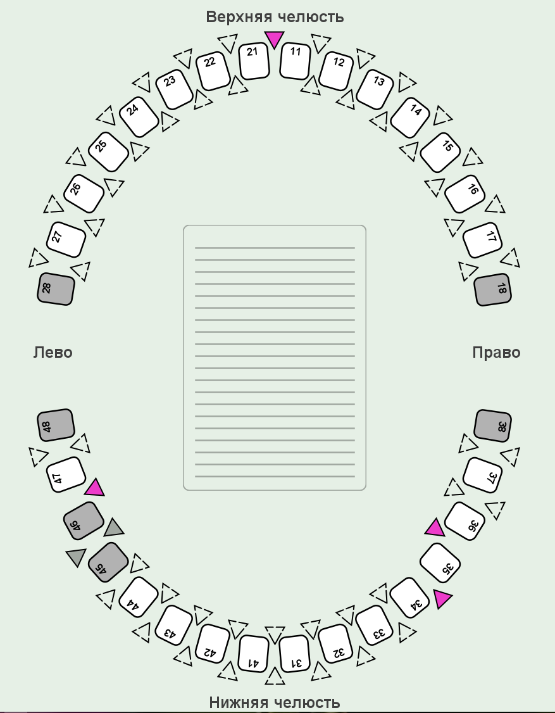

# Structure
App window with basic schema of human teeth, spaces between them and brushes. 

The app consists of 1 window:

And 3 main parts of it:
1. Central - a dental panel with teeth, spaces and comment field
2. Right - a right panel with brush types
3. Upper - a tool panel with tool buttons

## Dental panel
Contains [teeth](#tooth-properties), spaces and comments.

### Tooth properties:
- Tooth is a regular human tooth.
- Has own number.
- Can be marked as available and lost:
	- lost - there is no tooth in persons mouth;
	- available - by default, located in persons mouth.

### Space properties:
- Space - place between two teeth.
- Space is used for filling with brush.
- By default space is empty.
- Space may be outer or inner. Location determinates place in persons mouth:
	- inner - inside mouth;
	- outer - outside mouth.
- Each space can be filled with only one brush type.
- Space can be filled only when there is at least one available tooth near it.

### Brush properties:
- Brush is a little brush which is used for brushing spaces between teeth.
- There are several types of brushes, which determinates its diameter (mm): 0.4, 0.5, ..., 0.8, 1.1.