# Structure
App window with basic schema of human teeth, spaces between them and brushes. 

The app consists of 1 window:
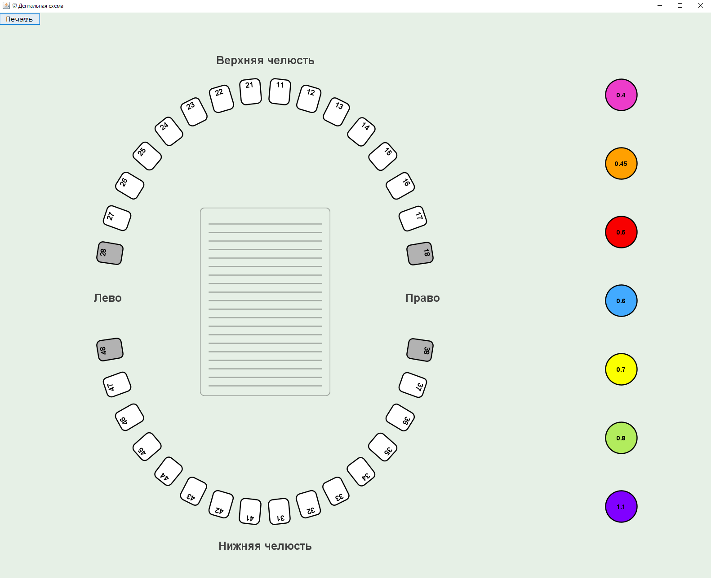

And 3 main parts of it:
1. [Central](#dental-panel) - a **dental panel** with teeth, spaces and comment field
2. [Right](#brush-panel) - a **brush panel** with brush types
3. [Upper](#tool-panel) - a **tool panel** with tool buttons

## Dental panel.
Contains [teeth](#tooth-properties), [spaces](#space-properties) and [comments](#comment-field-properties). It is the main working area where you can:
- Mark **teeth** available or not.
- Fill **spaces** with brushes or empty it.
- Write **comments**
When you click ['print' button](#print-button) , only this area goes to document.

### Tooth properties
Meaning of tooth:
- It is a regular human tooth.
- The number inside is selected according to [the FDI World Dental Federation Notation](https://en.wikipedia.org/wiki/FDI_World_Dental_Federation_notation?ysclid=mtohksk5ds6395777).
- Can be marked as '**available**' and '**lost**':
  - '**lost**' - a tooth has been lost, and there is no it in persons mouth;
  - '**available**' - by-default - a tooth hasn't been lost, and it is located in persons mouth.

Representation of tooth:
- A white or gray rectangle with border and number inside it.
- When '**lost**' - it's color is darker than when it is available.
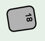
- When '**available**' - it's color is white.
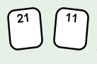

Action with tooth:
- You can make tooth **available** or **lost** with click on it.

### Space properties
Meaning of space:
- A space between two teeth.
- May be filled with a brush **but only from one side and with one type**.
- The filling side refers to the side where cleaning should begin.
- Space may be available or not:
  - it is **available** when at least one of two teeth near it is [available](#tooth-properties);
  - it is **unavailable** when both of teeth near it is [lost](#tooth-properties).

Representation of space:
- A pair of rectangles between two teeth with border from inner and outer sides of jaw.
- When **empty**:
  - You can see both triangles only when a [brush type selected](#brush-properties).
  - The color of it is the same as background.
  - Its border is dashed.
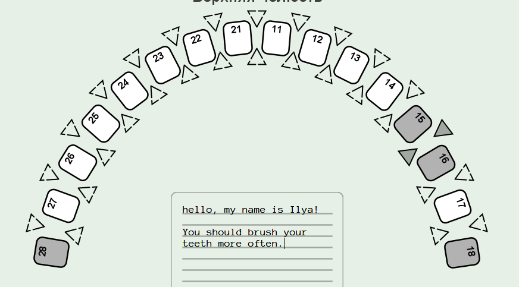
- When **filled with brush**:
  - You can see only one triangle.
  - The second triangle becomes invisible.
  - The color of visible triangle the same as one of [brushes type's circle](#brush-properties).
  - Its border is solid.
- When **unavailable**:
  - You can see both triangles only when a [brush type selected](#brush-properties).
  - The color of it is darker than background.
  - Its border is solid.
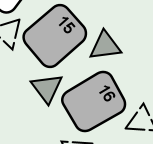
 
Action with space:
- You **can fill** the space by clicking on one of two triangles when brush type is [selected](#brush-properties).
- You **can't fill** the space when one of it true:
  - None of brush types is [selected](#brush-properties).
  - The space is unavailable.
- You **can fill** the triangle only from one side of the space.
- You can **change filled brush type** with [selecting](#brush-properties) another and clicking on visible triangle.
- You can **make space empty** by clicking on visible triangle when selected brush has the same color.

### Comment field properties
Meaning of comment field:
- A field where you can write comments for patient.

Representation of comment field:
- Static size rectangle area with strings and rows.
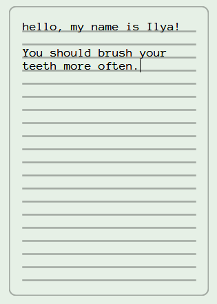
- It has limits in rows - 20, and in chars - 500.

Action with comment field:
- You can write and delete text as in notepad app.

## Brush panel
Contains [brush types](#brush-properties). This area uses to control selected brush.
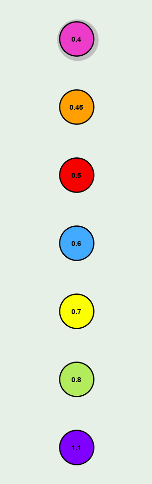

### Brush properties
Meaning of brush:
- A brush for between-teeth spaces like on image below.
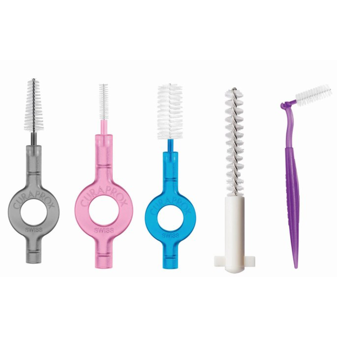
- There are represented next types of brushes: xxs, xs, s, m, l, xl, xxl. Each brush has own size (diameter in mm): 0.4, 0.45, 0.5, 0.6, 0.7, 0.8, 1.1.
- Brush may be selected and unselected:
  - When it is **selected**, you may fill spaces with it.
  - When it is **unselected**, there is nothing with it.

Representation of brush:
- A circle with special color and number inside.
- When **unselected** it has usual look: 
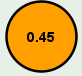
- When **selected** there it gets light-gray circle around:
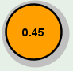

Action with brush:
- You can **select** a brush type with click on it.
- You can **unselect** a brush type with click on selected brush.
## Tool panel
The tool panel contains tool buttons. For now there is only print button.
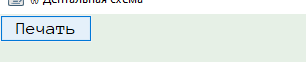

### Print button
Functions:
- Activates default print api of system.
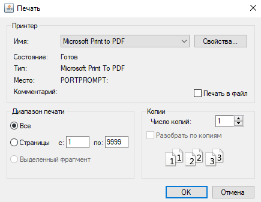