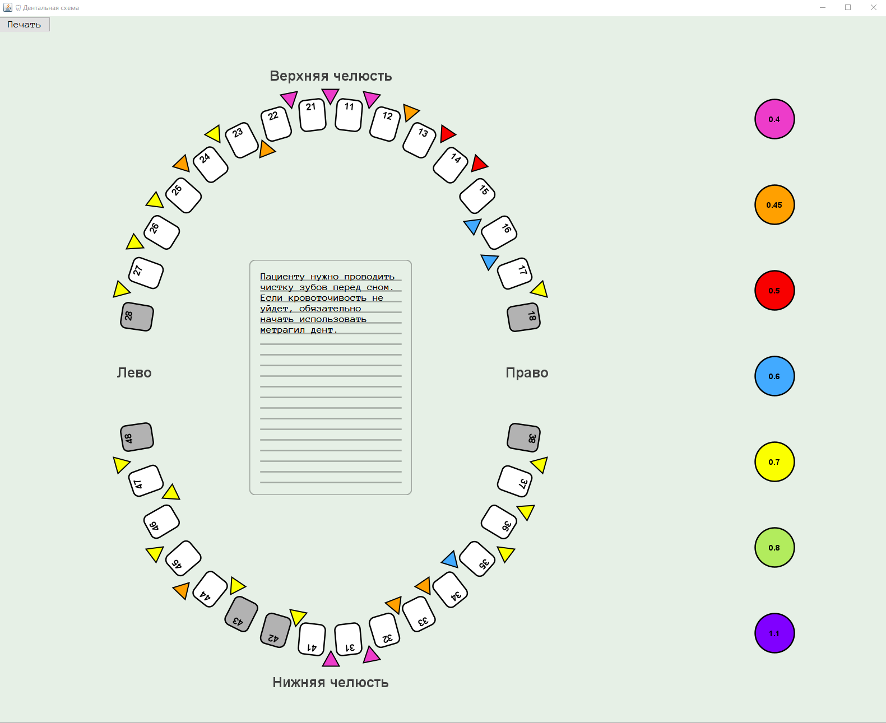

# DentalBrushScheme
DentalBrushScheme is an app that helps dentists create visual scheme of patient's mouth. 

This scheme contains information about mouth care.
Scheme can be printed as usual document and given to patient for take away.

You can see below how it looks like.

Each tooth has own number and can be marked as available or not.
The spaces can be filled with brushes so patient may look at it and clean it with proper brush size.
There is field for comments between jaws where doctor may leave useful information about mouth care. 
